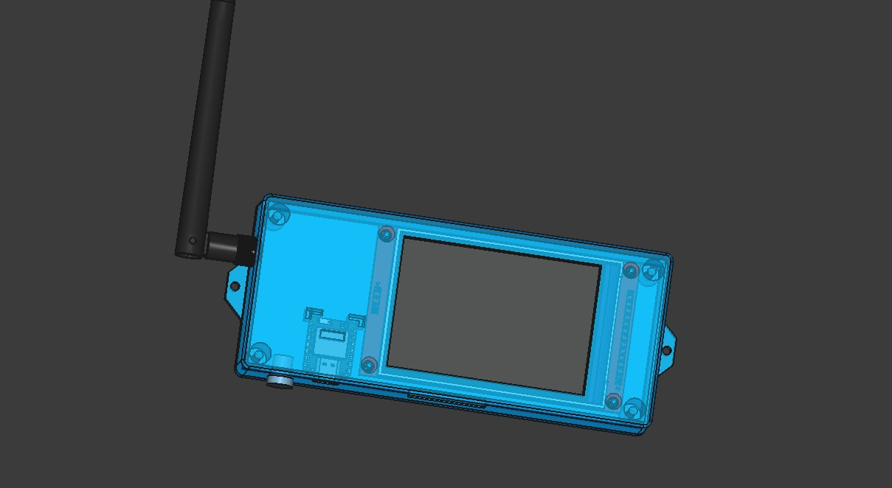
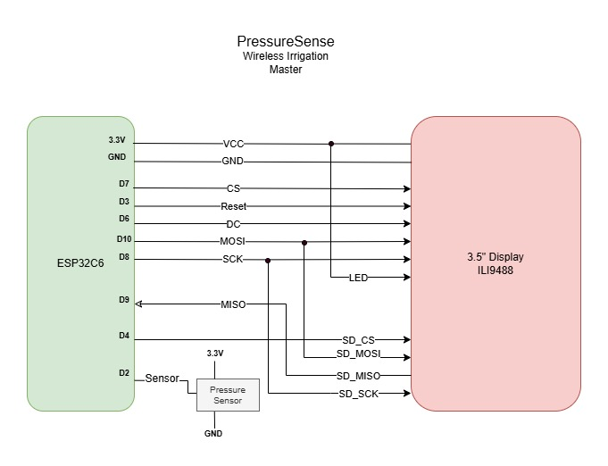

# PressureSense

PressureSense Pro is the master controller for an irrigation pressure-monitoring and zone-scheduling system. It runs on a Seeed Studio XIAO ESP32-C6, reads a 0-100 PSI analog pressure sensor, schedules and runs sprinkler zones, and commands a pair of remote relay boards ("Yard" and "Field") over LoRa. A web UI served directly from the ESP32's SPIFFS partition provides live charting, schedule/zone configuration, a sprinkler-system map, and SD/SPIFFS file management. An on-board 3.5" SPI TFT mirrors live status, and a dedicated WebSocket feed drives a separate "Indoor unit" display.

## System overview

- **PressureSense Pro (this repo)** — the scheduler and LoRa master. Decides which zone should be active from the zone table, current pressure, and time of day; reads the pressure sensor; logs data to SD; serves the web UI; and commands the Yard/Field boards over LoRa.
- **Yard / Field remotes** (separate firmware) — dumb relay executors. They accept LoRa relay commands, switch outputs, run their own safety timers, and ACK/ERROR/STATUS back to the master.
- **Indoor unit** (separate client) — connects to the master's `/ws` WebSocket and consumes the same `sensorUpdate`/`configData` JSON the CHART page uses, for a secondary indoor display.

## Hardware

   
  

| Component | Notes |
| --- | --- |
| MCU | Seeed Studio XIAO ESP32-C6 |
| Pressure sensor | Analog, two-point calibrated (30 PSI @ 1.5V, 60 PSI @ 2.9V), sampled via `analogReadMilliVolts()` |
| Display | 3.5" SPI TFT, ILI9488 driver via LovyanGFX (`src/Display.h`/`.cpp`) |
| LoRa | RYLR998 module on `HardwareSerial1`, AT-command configured at boot |
| Storage | SD card (daily CSV data logs, plus original copies of calibration/weather files kept as a rollback) + SPIFFS (web UI, `site.json`/`controllers.json`, per-zone flow `calibration.json`, `weather_state.json`/`weather_cache.json`/`weather_log.json`, OTA partitions) |
| Enclosure | 3D-printable design in `FreeCAD/` (native `.FCStd` source) |

Pin assignments, sensor calibration constants, and LoRa radio parameters are all `#define`d near the top of [src/main.cpp](src/main.cpp).

## Web UI

Served from SPIFFS at the device's IP, or `http://pressure-sense.local/` via mDNS (Windows PCs need Apple's free [Bonjour Print Services](https://support.apple.com/kb/DL999) installed once for `.local` names to resolve — macOS and iOS support this natively). Five pages share `data/style.css`:

| Page | Files | Purpose |
| --- | --- | --- |
| CHART | `index.html` / `index.js` | Live pressure gauge, OK/WARN/HIGH/LOW status badge, scheduled-zone card, manual zone/program start-stop, Highcharts pressure history (today or any saved day) with an optional ET0/precipitation weather overlay, status bar (location, sample rate, seasonal adjustments, zone delays, calibration offset) |
| CONFIG | `config.html` / `config.js` | Zone schedule editor: per-controller program cards (start time, day pips, duration, end time, overlap warning) with a popover to edit start/days/zone-delay/seasonal-adjustment; zones support drag-to-reorder, inline name/PSI/run editing with live-recalculated start times, add/delete. "Save Zone Config" saves only the schedule (to `controllers.json`, or a named seasonal preset); Location, Sensor Rate, and Weather & Auto-Adjust settings each save independently to `site.json`; "Set as Active Schedule" promotes a loaded preset to be the live schedule |
| CALIB | `calibration.html` / `calibration.js` | Per-zone irrigation flow calibration (head specs + SVG-measured area → `mm_per_min`) with an editable Head Catalog, import from the `zone_calibration.py` script's output, and PSI calibration (moved here from CONFIG) |
| MAP | `map.html` / `map.js` | Renders the sprinkler layout SVG, highlights whichever zone(s) are currently active, full-yard or zoomed yard-only view with pan/zoom |
| FILES | `files.html` / `files.js` | Browse/delete SPIFFS and SD card files, preview JSON/text file contents, reboot the ESP32 |

CHART and MAP get live updates over Server-Sent Events at `/events`; the Indoor unit instead uses the JSON WebSocket at `/ws`.

## Key features

- **Zone scheduling** — `controllers.json` (a bare array: controllers → programs → zones) drives automatic activation; see [Zone schedule format](#zone-schedule-format) below.
- **Overlap detection** — the CONFIG page warns when two programs on the same controller share a day and their derived time windows intersect.
- **Manual control** — start/stop an individual zone or an entire lettered program (A-D) outside the schedule, each with its own run timer.
- **Seasonal adjustment** — a per-program percentage (`seasonal_adjust_pct`) that scales that program's scheduled run times up or down.
- **Zone-to-zone delay** — a per-program pause (`zone_delay_sec`) before a chained zone's relay turns on; it shortens that zone's own watering time and never shifts the nominal schedule.
- **Weather auto-adjust** — fetches daily ET0/precipitation from Open-Meteo, tracks a per-zone soil-water deficit, and scales each zone's run time (or skips a program entirely ahead of significant forecast rain) accordingly; enabled/tuned from the CONFIG page, with a 90-day history (`weather_log.json`) chartable on the CHART page.
- **Pressure calibration** — a one-point offset (entered as "actual PSI" against the live raw reading, computed client-side and persisted in `site.json`'s `psi_offset`) layered on top of the two-point factory calibration; set from the CALIB page.
- **Pressure status** — the CHART badge, the chart point colors, and the LoRa master itself (`buildPressureStatus()` in `main.cpp`, kept in sync with `updateStatStatus()` in `index.js`) all classify the live reading against the active zone's target PSI as OK / WARN / HIGH / LOW.
- **Simulation mode** — inject a fixed PSI value in place of the ADC reading, for testing the UI/alerts without water flowing.
- **Data logging** — one CSV per day on the SD card; CHART loads the current day live or any historical day from the file picker.
- **OTA updates** — ElegantOTA, mounted on the same web server.
- **All-off safety** — `ALL_OFF` is sent to both remotes before every zone transition.
- **Pressure vs. schedule state** — zone relay control (`serviceRemoteZoneControl()`), weather auto-adjust's water-applied accumulators, and the deviation alert are all driven by the schedule (`checkActiveZone()`'s `zoneNumber`/`zoneAvgPsi`, and `manualZoneRuns[]` for manual runs), not by pressure. `ZONES_ALL_OFF_PSI`/`currentPressure` only drive the informational `allOff` field broadcast over `/ws` and the TFT gauge's color threshold. (These used to also gate the items above — pressure on this system's tank setup snaps to ~62 PSI on a refill and takes hours to decay back down, so requiring PSI to first drop below `ZONES_ALL_OFF_PSI` could delay, or with a tight enough schedule entirely skip, turning a zone's relay on. Fixed — see git history.)

## Zone schedule format

`data/controllers.json` is the single source of truth for irrigation scheduling — a bare array, read directly by the firmware (`checkActiveZone()` in `main.cpp`) and edited on the CONFIG page. Site identity, sensor rate, PSI calibration, and weather/auto-adjust settings live separately in `data/site.json`; the CONFIG page's `/load-zone-table` endpoint recombines both files into one document for rendering, but they're saved independently (schedule via `/submit-zone-form`, site settings via `/submit-site-form`):

```json
[
  {
    "id": "yard",
    "name": "Yard",
    "programs": [
      {
        "id": "A",
        "days": [0, 1, 2, 3, 4, 5, 6],
        "start": "05:00",
        "zone_delay_sec": 0,
        "seasonal_adjust_pct": 0,
        "zones": [
          { "znumber": 1, "zname": "Garage", "avgpsi": 47, "run": 45 }
        ]
      }
    ]
  }
]
```

`site.json` holds the rest:

```json
{
  "name": "Silver Creek Ranch",
  "sensor_interval_sec": 30,
  "psi_offset": 0.0,
  "latitude": 43.6, "longitude": -116.6, "timezone": "America/Denver",
  "mm_per_min_default": 0.25,
  "weather": { "enabled": true, "auto_adjust": true, "reference_deficit_mm": 6.0, "max_deficit_mm": 25.0, "max_adjust_pct": 150, "min_adjust_pct": 0, "rain_skip_threshold_mm": 6.0 }
}
```

- `days` is an integer array, `0` = Sunday … `6` = Saturday.
- A zone's actual start time is **derived**, never stored: the first zone in a program starts at the program's `start`; every later zone starts when the previous one's `run` ends. `zone_delay_sec` only pauses that zone's relay turn-on — it shortens the zone's own watering time and never shifts this schedule.
- `seasonal_adjust_pct` and `zone_delay_sec` live on the program, not per zone.
- The CONFIG page's "Load External"/"Save As" mechanism supports named schedule presets (e.g. `controllers_spring.json`, `controllers_summer.json`) alongside the live `controllers.json` — "Set as Active Schedule" promotes whichever preset is currently loaded/edited to be the live schedule.

## Data log format

One row per sample, appended to a daily CSV on the SD card (filename from `generateDailyFilename()`):

```
readingID,date,time,psi,zoneNumber,zoneAvgPsi
```

## HTTP API

All routes are registered in `setup()` in `src/main.cpp`. Static assets (the `data/` folder) are served directly from SPIFFS at `/`.

| Endpoint | Method | Purpose |
| --- | --- | --- |
| `/get-data-file` | GET | Fetch a CSV log file by name |
| `/get-daily-filename` | GET | Current day's log filename |
| `/list-sd-card-files`, `/list-spiffs-files`, `/list-json-files` | GET | File listings for the FILES page |
| `/get-spiffs-json-file` | GET | Read a JSON file from SPIFFS |
| `/delete-file` | GET | Delete a file from SD or SPIFFS |
| `/load-zone-table`, `/load-sd-zone-table` (compat alias), `/load-spiffs-zone-table?filename=` | GET | `site.json` + `controllers.json` recombined into one document for the CONFIG page (see [Zone schedule format](#zone-schedule-format)); `/load-spiffs-zone-table` also serves a named schedule preset or any other SPIFFS `.json` by filename |
| `/submit-zone-form?filename=` | POST | Save only the schedule — to `controllers.json` by default, or a named preset (e.g. `controllers_summer.json`) if `filename` is given |
| `/submit-site-form` | POST | Save site identity, sensor rate, and weather/auto-adjust settings to `site.json` (independent of the schedule save) |
| `/submit-calib-offset` | POST | Save just the PSI calibration offset to `site.json` (CALIB page) |
| `/calibration.json`, `/submit-calibration-form` | GET / POST | Per-zone flow calibration (`mm_per_min`, head specs, SVG area) — CALIB page |
| `/weather-state`, `/weather_cache.json`, `/weather_log.json` | GET | Firmware-computed weather auto-adjust state, the last raw Open-Meteo response, and the 90-day deficit/adjustment history |
| `/weather-fetch-now` | GET | Queue an on-demand weather fetch (runs on the next `loop()` tick, not inline, to avoid blocking the request task) |
| `/get-schedules-enabled`, `/set-schedules-enabled` | GET / POST | Pause / resume automatic scheduling |
| `/manual-zones` | GET | Current manual zone/program run status |
| `/manual-zone`, `/manual-program` | POST | Start/stop a manual zone or lettered program; `/manual-program` also takes `action: "next"` to skip a running program straight to its next zone (or stop it, if the current zone is the last one) |
| `/set-sim-pressure`, `/clear-sim` | GET | Enable / disable simulation mode |
| `/sd-usage` | GET | SD card usage + WiFi/uptime, for page footers (SD-only despite the name — there's no SPIFFS equivalent) |
| `/ping` | GET | Lightweight health check: uptime, heap stats, WS client count |
| `/reset` | GET | Reboot the ESP32 |
| `/events` | SSE | Live `new-readings` push for CHART/MAP |
| `/ws` | WebSocket | `sensorUpdate` / `configData` JSON for the Indoor unit |

## Getting started

1. **Secrets** — copy `include/secrets.example.h` to `include/secrets.h` and fill in your WiFi SSID/password. `include/secrets.h` is git-ignored.
2. **Build & flash firmware**:
   ```
   pio run --target upload
   ```
3. **Upload the web UI** (everything in `data/`) to SPIFFS:
   ```
   pio run --target uploadfs
   ```
4. **Monitor serial output**:
   ```
   pio device monitor
   ```
5. Visit `http://pressure-sense.local/` (mDNS) or the IP address printed on boot. **Windows users:** `.local` hostnames aren't resolved by Windows out of the box — install Apple's free [Bonjour Print Services](https://support.apple.com/kb/DL999) once, or just use the IP address shown on the TFT/serial log. macOS and iOS resolve `.local` natively, no install needed.

Subsequent firmware updates can go over the air via ElegantOTA at `<device-ip>/update` once the device is reachable on WiFi.

### Boot sequence (serial log markers)

```
[1]  TFT display init
[1b] LoRa radio init (RYLR998 AT config)
[2]  WiFi connect + mDNS (pressure-sense.local)
[3]  SPIFFS mount
[4]  SD card mount
[5]  NTP time sync
[6]  Daily log file + saved location
[7]  Web server + OTA started
```

## Project structure

```
src/main.cpp            Firmware: WiFi/SPIFFS/SD/NTP setup, sensor reads, scheduling,
                         LoRa master protocol, HTTP/WS/SSE server, OTA
src/Display.h/.cpp      LovyanGFX TFT UI (mirrors the web CHART page on-device)
include/secrets.h       WiFi credentials (git-ignored; see secrets.example.h)
data/                   Web UI served from SPIFFS -- index/config/calibration/map/files .html + .js, style.css
data/zone-utils.js      Shared schedule math (derived start/end times, day-array matching,
                         overlap detection) used by both config.js and index.js
data/site.json          Site identity/sensor-rate/calibration/weather config -- checked in as the
data/controllers.json   default seed data so a fresh flash ships a working setup instead of an
                         empty one (see Zone schedule format above); overwritten by whatever you
                         save from the CONFIG page afterward
data/controllers_spring.json   Seasonal schedule presets -- starting points to customize via the
data/controllers_summer.json   CONFIG page's Load External/Save As, then "Set as Active Schedule"
data/controllers_fall.json     to make one live
calib/                  Zone flow calibration tooling: zone_calibration.py's own output
                         (zone_calibration.json/.txt), independent of the device's calibration.json
scripts/zone_calibration.py     Computes per-zone mm_per_min from head specs + SVG-measured area
scripts/dxf_to_svg.py           Converts a QCAD/AutoCAD DXF sprinkler drawing to SVG for the MAP page
scripts/remove_qcad_trial.py    Strips QCAD trial-version watermark artifacts from exported SVGs
docs/                   Architecture reference diagram (PressureSenseMaster.drawio.png)
FreeCAD/                Enclosure CAD source (enclosure.FCStd)
images/                 Reference photos
platformio.ini          Board/framework/library config (seeed_xiao_esp32c6, Arduino framework)
partitions.csv          Custom partition table (dual OTA app slots + SPIFFS)
```
